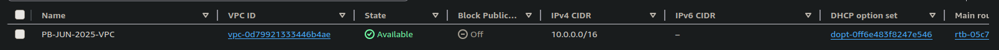
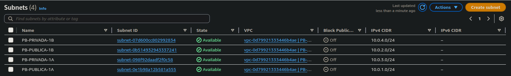
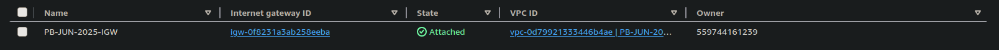
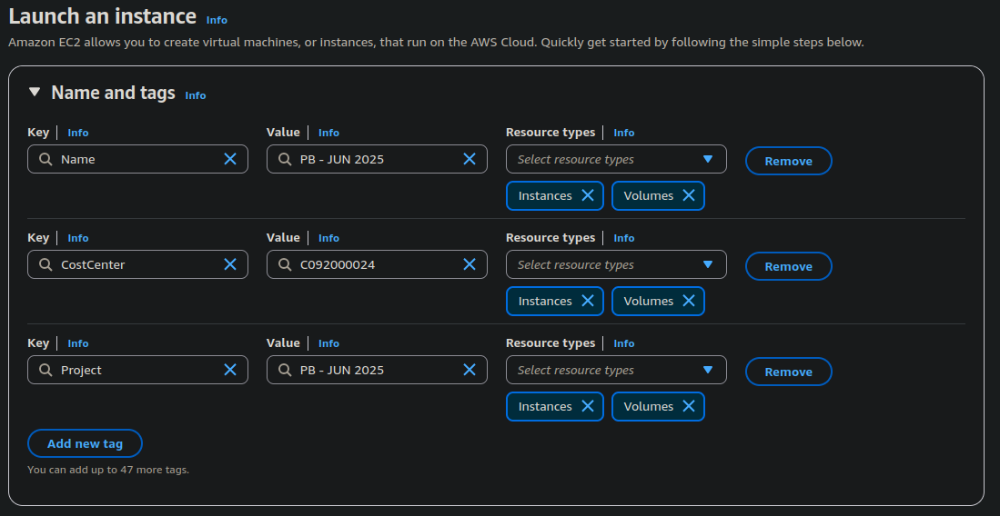
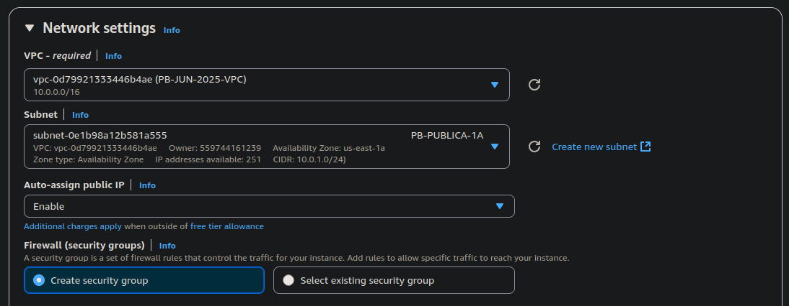
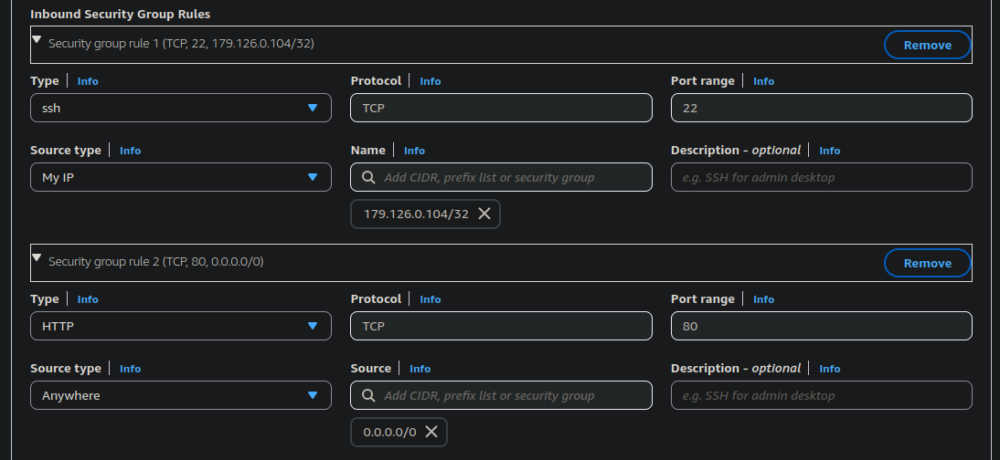
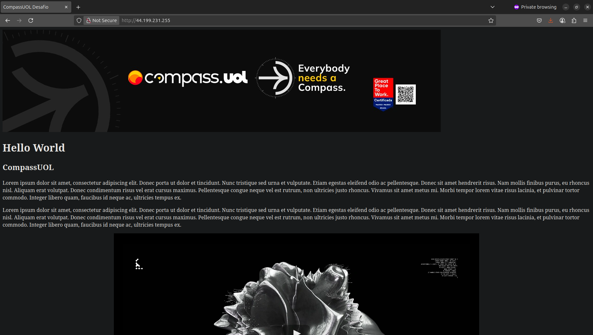

# Projeto PB - JUN 2025: Servidor Web com Monitoramento na AWS


## 👨‍💻 Objetivo

Este projeto faz parte da disciplina de Linux no Programa de Bolsas DevSecOps da Compass UOL. O objetivo é criar uma infraestrutura em nuvem utilizando AWS com um servidor web (Nginx) e monitoramento via script, documentando todo o processo.

---

## 🧱 Etapa 1: Configuração da Infraestrutura na AWS

### 🔸 VPC Personalizada

Criei uma VPC com o bloco CIDR `10.0.0.0/16`, contendo:

- **2 sub-redes públicas** (`10.0.1.0/24`, `10.0.2.0/24`)
- **2 sub-redes privadas** (`10.0.3.0/24`, `10.0.4.0/24`)
- **Internet Gateway** anexada à VPC
- **Tabela de rotas públicas** configurada para redirecionar o tráfego `0.0.0.0/0` para o Internet Gateway

### 📸 Print: Criação da VPC, sub-redes e gateway  




---

## 🚀 Etapa 2: Instância EC2 e Configuração do Servidor Web

### 🔸 Criação da Instância EC2

- AMI utilizada: **Amazon Linux 2023**
- Tipo: `t2.micro` (Free Tier)
- Sub-rede: Pública (com IP público automático habilitado)
- Regras de segurança:
  - Porta 22 (SSH) liberada para meu IP
  - Porta 80 (HTTP) liberada para acesso global

### 📸 Print: Configuração da EC2  
_(Inserir print do painel de criação da EC2 e security group)_




---

### 🔸 Instalação do Nginx

Após conectar via SSH com o comando:

```bash
ssh -i "key-pb.pem" ec2-user@<IP_DA_INSTANCIA>
```

Executei:

```bash
sudo dnf update -y
sudo dnf install nginx -y
sudo service nginx start
sudo chkconfig nginx on
```

### 🔸 Página HTML personalizada

Substituí a página padrão do Nginx pelo arquivo index.html que colei e salvei:

```bash
sudo nano /usr/share/nginx/html/index.html
```

A página pode ser acessada via IP público da instância.

### 📸 Print: Página acessível no navegador  


---

## 📟 Etapa 3: Script de Monitoramento

### 🔸 Objetivo

Criar um script que verifica se o site está online a cada 1 minuto. Caso não esteja, envia uma notificação via Discord.


### 🔸 Criei arquivo

```bash
nano monitor.sh
```

### 🔸 Script em Bash (exemplo com curl)

```bash
#!/bin/bash

LOGFILE="/home/ec2-user/monitoramento.log"
URL="http://44.199.231.255"
WEBHOOK_URL="https://discord.com/api/webhooks/meu_webhook"

STATUS=$(curl -s -o /dev/null -w "%{http_code}" $URL)
DATA=$(date '+%Y-%m-%d %H:%M:%S')

if [ "$STATUS" -ne 200 ]; then
    MENSAGEM="🚨 [$DATA] O site está FORA DO AR! Código HTTP: $STATUS"
    echo "$MENSAGEM" >> "$LOGFILE"

    curl -H "Content-Type: application/json" \
         -X POST \
         -d "{\"content\": \"$MENSAGEM\"}" \
         "$WEBHOOK_URL"
else
    echo "[$DATA] Site funcionando. Código: $STATUS" >> "$LOGFILE"
fi
```

### 🔸 Permissão e teste

```bash
sudo chmod +x monitorar.sh
```


```bash
./monitorar.sh
```

### 🔸 Agendamento com cron

```bash
sudo crontab -e
```

Adicione:

```cron
* * * * * /usr/local/bin/monitorar.sh
```

### 📸 Print: Logs em `/var/log/monitoramento.log`  


---

## ✅ Etapa 4: Testes e Validação

- Testei o acesso ao site via navegador.
- Desativei o Nginx (`sudo systemctl stop nginx`) para testar o script.
- Recebi a notificação via webhook quando o site ficou indisponível.
- O log foi registrado corretamente.

### 📸 Print: Teste com Nginx parado e alerta enviado  


---

## 📝 Conclusão

Projeto finalizado com sucesso! A instância EC2 está funcional, servindo a página web e monitorada por script automático. A documentação e prints demonstram cada etapa do processo.

---

## 🔒 Observações

- A chave `.pem` usada para o SSH **não está incluída no repositório**, por segurança.
- O webhook foi mantido fora do script público para evitar vazamento de credenciais.

---

## ✨ Melhorias futuras (bônus)

- Automatizar tudo via **User Data**
- Criar template **CloudFormation** com a infraestrutura
- Enviar métricas para **CloudWatch**
